\##Question 1:

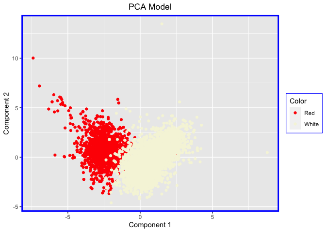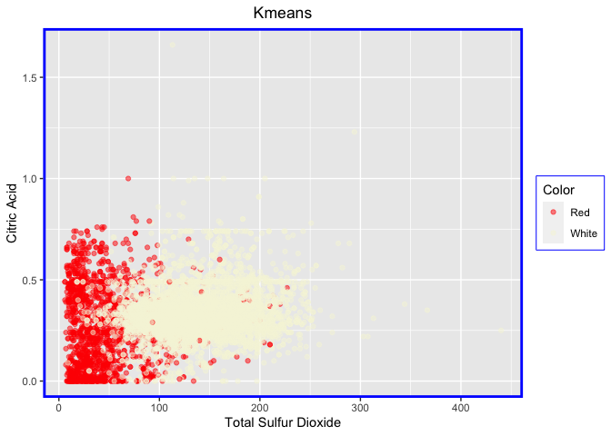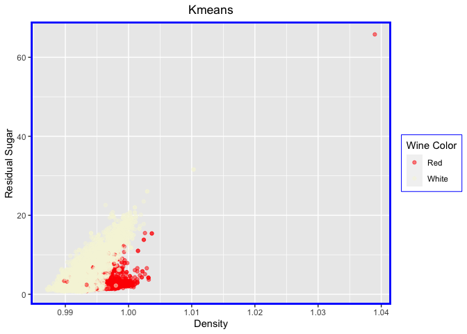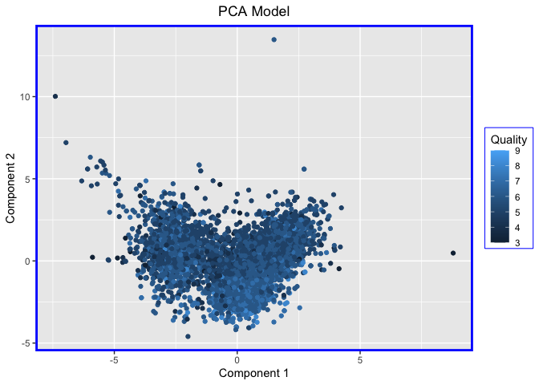
Overall, we see that the PCA model does a better job of distinguishing
between the red and white wines in comparison to the kmeans clustering
algorithm. The reasoning behind PCA outperforming the Kmeans clustering
is because it compresses the features whereas kmeans clustering
compresses the data points themselves. In the application of this case,
it works better because we are focussing on the differences between the
features.

We then used the PCA method to analyze if it could distinguish between
different quality wines. Given the graph above, we deduce that the PCA
method is not very accurate at distinguishing the different quality
wines.

\##Question 2:

# The goal

“NutrientH20” (pseudonym) wants to understand its social-media audience
a little bit better, so that it could hone its messaging a little more
sharply.

# Assumptions

For the sake of this analysis (based on the pseudonym) we will
**consider NutrientH20 as a nutrient water brand which is entering the
market of flavoured electrolytes**.

# Approach

1.  Identify scope+context of problem (goal+assumptions)
2.  Data normalization
3.  Testing
    1.  KNN Clustering
    2.  PCA
    3.  Cluster Identification
4.  Recommendation

# Data pre-processing

The dataset includes 36 tweet categories for 7882 users and each cell
represents how many times each user has posted a tweet that can be
tagged to that category. The categories include…

<table>
<thead>
<tr class="header">
<th style="text-align: left;">x</th>
</tr>
</thead>
<tbody>
<tr class="odd">
<td style="text-align: left;">adult</td>
</tr>
<tr class="even">
<td style="text-align: left;">art</td>
</tr>
<tr class="odd">
<td style="text-align: left;">automotive</td>
</tr>
<tr class="even">
<td style="text-align: left;">beauty</td>
</tr>
<tr class="odd">
<td style="text-align: left;">business</td>
</tr>
<tr class="even">
<td style="text-align: left;">chatter</td>
</tr>
<tr class="odd">
<td style="text-align: left;">college_uni</td>
</tr>
<tr class="even">
<td style="text-align: left;">computers</td>
</tr>
<tr class="odd">
<td style="text-align: left;">cooking</td>
</tr>
<tr class="even">
<td style="text-align: left;">crafts</td>
</tr>
<tr class="odd">
<td style="text-align: left;">current_events</td>
</tr>
<tr class="even">
<td style="text-align: left;">dating</td>
</tr>
<tr class="odd">
<td style="text-align: left;">eco</td>
</tr>
<tr class="even">
<td style="text-align: left;">family</td>
</tr>
<tr class="odd">
<td style="text-align: left;">fashion</td>
</tr>
<tr class="even">
<td style="text-align: left;">food</td>
</tr>
<tr class="odd">
<td style="text-align: left;">health_nutrition</td>
</tr>
<tr class="even">
<td style="text-align: left;">home_and_garden</td>
</tr>
<tr class="odd">
<td style="text-align: left;">music</td>
</tr>
<tr class="even">
<td style="text-align: left;">news</td>
</tr>
<tr class="odd">
<td style="text-align: left;">online_gaming</td>
</tr>
<tr class="even">
<td style="text-align: left;">outdoors</td>
</tr>
<tr class="odd">
<td style="text-align: left;">parenting</td>
</tr>
<tr class="even">
<td style="text-align: left;">personal_fitness</td>
</tr>
<tr class="odd">
<td style="text-align: left;">photo_sharing</td>
</tr>
<tr class="even">
<td style="text-align: left;">politics</td>
</tr>
<tr class="odd">
<td style="text-align: left;">religion</td>
</tr>
<tr class="even">
<td style="text-align: left;">school</td>
</tr>
<tr class="odd">
<td style="text-align: left;">shopping</td>
</tr>
<tr class="even">
<td style="text-align: left;">small_business</td>
</tr>
<tr class="odd">
<td style="text-align: left;">spam</td>
</tr>
<tr class="even">
<td style="text-align: left;">sports_fandom</td>
</tr>
<tr class="odd">
<td style="text-align: left;">sports_playing</td>
</tr>
<tr class="even">
<td style="text-align: left;">travel</td>
</tr>
<tr class="odd">
<td style="text-align: left;">tv_film</td>
</tr>
<tr class="even">
<td style="text-align: left;">uncategorized</td>
</tr>
</tbody>
</table>

## Data normalization

The solution here is that the columns have similar items with values for
frequency of occurrence, thus, I calculate the term frequencies as % of
tweets tagged to a category per user. This normalizes for the difference
in number of tweets per user.

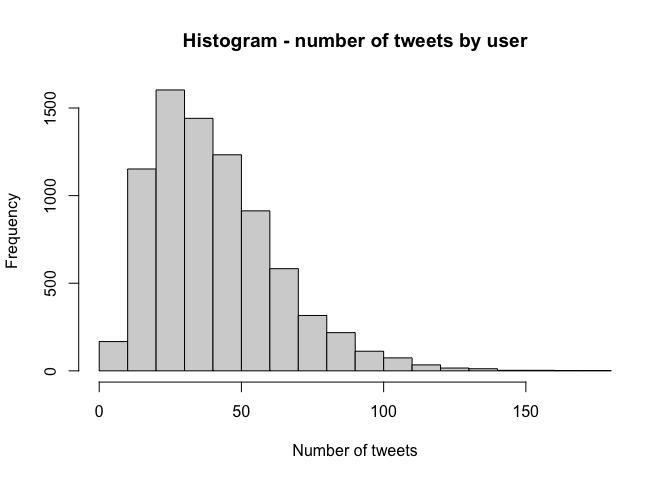

## Outlier removal

Looking at the 4 unwanted categoies - **chatter**, **uncategorized**,
**adult** and **spam** and see the percentage of data filtered when we
set a range of cutoffs on the term frequency of that particular category
for every user.

1.  Chatter

2.  Adult

3.  Spam

4.  No Category

Here are the cutoffs representing the outliers of our base data:

1.  chatter&gt;0.25 (9%)
2.  adult&gt;0.20 (1.5%)
3.  spam&gt;0.01 (0.6%)
4.  no category&gt;0.16 (0.57%)

Then, checked for mutual exclusivity of these rows (taking loss of data
into account) and if we remove rows with these features, a loss of
12-13% of the data is incurred, which was deemed a practical trade off
for removing a lot of noise from the data, mainly due to these 4 columns

### Why these columns?

1.  Chatter and no category tweets will not help with clustering, their
    correlation with any field is assumed as being a coincidence.

2.  Spam and adult are categories not to be desired in clustering.

# Customer Segments (Intuition)

# Correlated categories

When looking at the set of categories, we expected some categories to
have a strong correlation. Thus, in setting a cutoff, we looked at the
number of pairs that made the correlation cutoff.

<table>
<thead>
<tr class="header">
<th style="text-align: left;">Var1</th>
<th style="text-align: left;">Var2</th>
<th style="text-align: right;">Freq</th>
</tr>
</thead>
<tbody>
<tr class="odd">
<td style="text-align: left;">personal_fitness</td>
<td style="text-align: left;">health_nutrition</td>
<td style="text-align: right;">0.8099024</td>
</tr>
<tr class="even">
<td style="text-align: left;">college_uni</td>
<td style="text-align: left;">online_gaming</td>
<td style="text-align: right;">0.7728393</td>
</tr>
<tr class="odd">
<td style="text-align: left;">fashion</td>
<td style="text-align: left;">cooking</td>
<td style="text-align: right;">0.7214027</td>
</tr>
<tr class="even">
<td style="text-align: left;">beauty</td>
<td style="text-align: left;">cooking</td>
<td style="text-align: right;">0.6642389</td>
</tr>
<tr class="odd">
<td style="text-align: left;">politics</td>
<td style="text-align: left;">travel</td>
<td style="text-align: right;">0.6602100</td>
</tr>
<tr class="even">
<td style="text-align: left;">parenting</td>
<td style="text-align: left;">religion</td>
<td style="text-align: right;">0.6555973</td>
</tr>
<tr class="odd">
<td style="text-align: left;">religion</td>
<td style="text-align: left;">sports_fandom</td>
<td style="text-align: right;">0.6379748</td>
</tr>
<tr class="even">
<td style="text-align: left;">fashion</td>
<td style="text-align: left;">beauty</td>
<td style="text-align: right;">0.6349739</td>
</tr>
<tr class="odd">
<td style="text-align: left;">outdoors</td>
<td style="text-align: left;">health_nutrition</td>
<td style="text-align: right;">0.6082254</td>
</tr>
<tr class="even">
<td style="text-align: left;">parenting</td>
<td style="text-align: left;">sports_fandom</td>
<td style="text-align: right;">0.6077181</td>
</tr>
<tr class="odd">
<td style="text-align: left;">computers</td>
<td style="text-align: left;">travel</td>
<td style="text-align: right;">0.6029349</td>
</tr>
</tbody>
</table>

Above are the number of unique pairs of categories that made the cut
above a certain correlation value. 11 seems to be a reasonable number to
compare. Categories with corr&gt;0.6 can expect to be seen together as
the features of the clusters being created.

Therefore, here are the four broad clusters of customers:

## 1) The healthy

**personal\_fitness**, **health\_nutrition** lead to the highest
correlation of 0.8, followed by **health\_nutrition** and **outdoors**
with a correlation of 0.6. The first category should be populated by
people who are health and fit-oriented.

## 2. Gen X

**parenting**, **religion** and **sports\_fandom** - all 3 categories
have correlation of 0.6 meaning a potential uniform association among
all three. We are assuming Gen X to be in this category.

## 3. Social Media People

**Beauty**, **Cooking** and **Fashion** … all 3 categories are
correlated with each other (0.63 - 0.72). While these people might not
be focused on a healthy lifestyle in terms of exercise and eating right,
they are focused on how they look, social media association fits this
mold.

## 4. Gamer

There was one pair (**college\_uni** and **online\_gaming**) correlation
of 0.77, which hits at the young age group around their later teens and
early 20s.

# Testing

# Clustering using KNN

We perform z-scoring on the dataset and create a grid for number of
clusters in KNN to see where the elbow comes in our curve

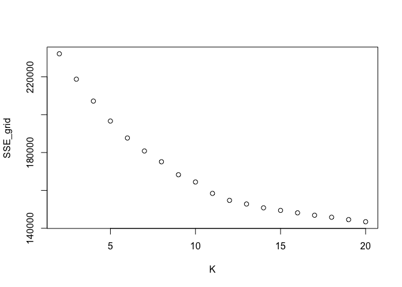

Given that there is no clear edge, we set our range of k in \[3,6\] for
clustering based on our intuition and testing. Clustering will help pull
individual customers in separate groups based on similarities in
tweeting patterns.

# Principal Component Analysis

Principal Component Analysis helps understand the composition of each
point as an aggregation of the different numbers and types of tweets. I
consider only the first two principal components.

## PCA and KNN

Comparing the results of KNN and PCA.

Different plots from KNN:

    Warning: `qplot()` was deprecated in ggplot2 3.4.0.
    This warning is displayed once every 8 hours.
    Call `lifecycle::last_lifecycle_warnings()` to see where this warning was
    generated.

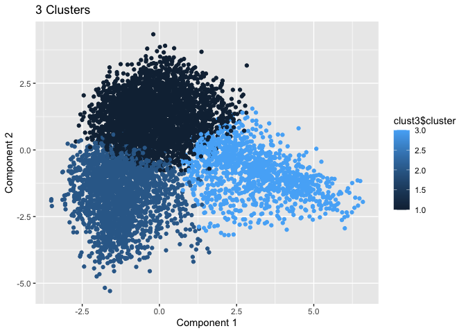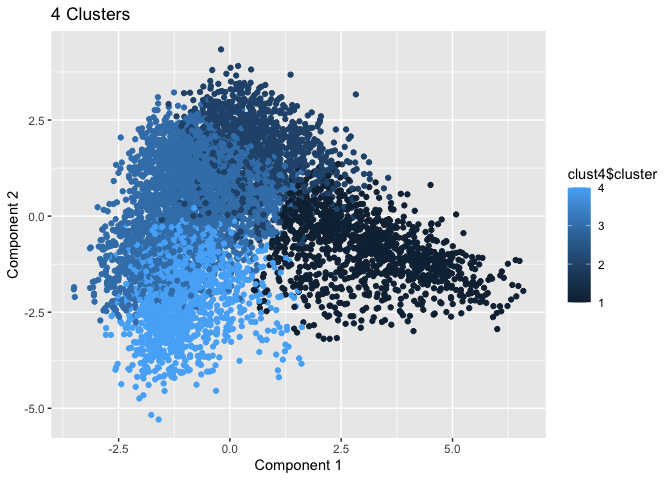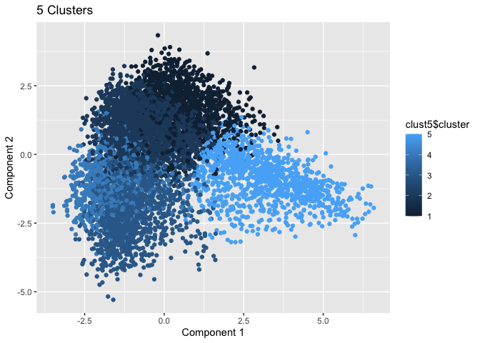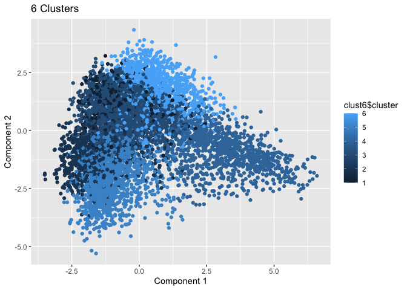

Looking at how PC1 and PC2 are formed in terms of categories:

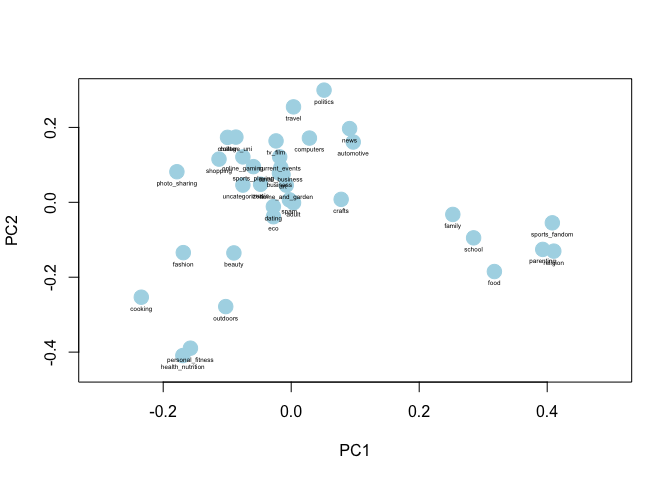

We can see 5 clusters have formed…

## Cluster Identification

Comparing plots for both categories along PC1 and PC2, we can identify
the segments

#### 1. The healthy

**personal\_fitness**, **health\_nutrition** and **outdoors** appear
close by between PC1=\[-0.2,-0.1\] and PC2=\[-0.45,-0.3\]

#### 2. Social Media

**Beauty**, **Cooking** and **fashion** … 3 categories lying between
younger ages reflecting categories like **college\_uni**,
**online\_gaming**, **photo\_sharing** and health/fit focused
**personal\_fitness**, **health\_nutrition**, **outdoors**.

#### 3. Gamer

The 2 clusters above, **college\_uni** and **online\_gaming** interact
with other categories that gamers are likely to tweet about.

#### 4. Travel

**politics** and **travel** landing close to **news**, allows us to
identify this cluster as traveling people who keep up with current
events.

#### 5. Gen X

**parenting**, **religion** and **sports\_fandom** … all show up along
the right of PC1 after **food**, **school** and **family**.

\##Question 3:

    itemFrequencyPlot(groceries, topN=25, type='absolute')

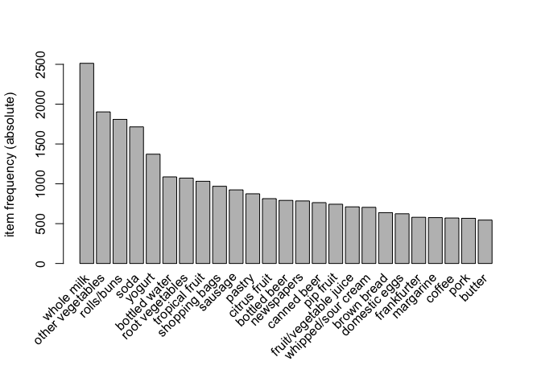

## Shown from the plot, the frequency of occurence for items like whole milk, vegetables, rolls, soda, yogurt have frequency of occurences more than 1000, and thus, will most likely play an important role in the rule mapping.

## This finds all association rule mappings(129) that have a support of 0.001 and confidence of 0.90 (at the minimum). 0.1% is considered a good number as the overall dataset size is high (about 10000). We take a higher confidence as it indicates 90% probablity that these mappings occur in the basket. We want to consider all possible items in the basket.

    plot(grocrules)

    To reduce overplotting, jitter is added! Use jitter = 0 to prevent jitter.

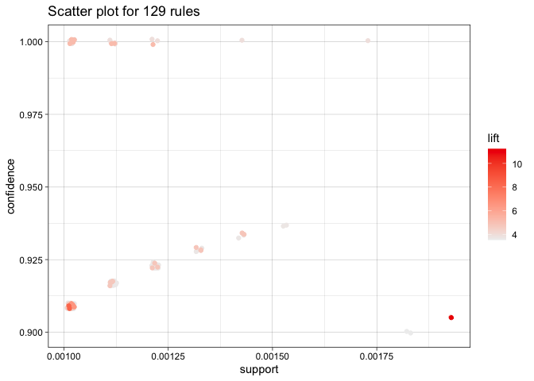

## Here, the lift value keeps decreasing as we increase the support and confidence. Thus, taking the right mix of the confidence, support and lift to identify the best rule mappings is crucial.

## The lift value is &gt; 5, which means there is 5 times greater chance of RHS outcome occuring if LHS occurs, which causes a high lift value. There are higher chances of other vegetables occuring in combination with tropical fruit, citrus fruit, sour cream and similarly root vegetables, yogurt occurs with higher chances if butter, sliced cheese, cream cheese occur.

    plot(head(sort(grocrules, by="support"), 20),
      method="graph", control=list(cex=.9))

    Warning: Unknown control parameters: cex

    Available control parameters (with default values):
    layout   =  stress
    circular     =  FALSE
    ggraphdots   =  NULL
    edges    =  <environment>
    nodes    =  <environment>
    nodetext     =  <environment>
    colors   =  c("#EE0000FF", "#EEEEEEFF")
    engine   =  ggplot2
    max  =  100
    verbose  =  FALSE

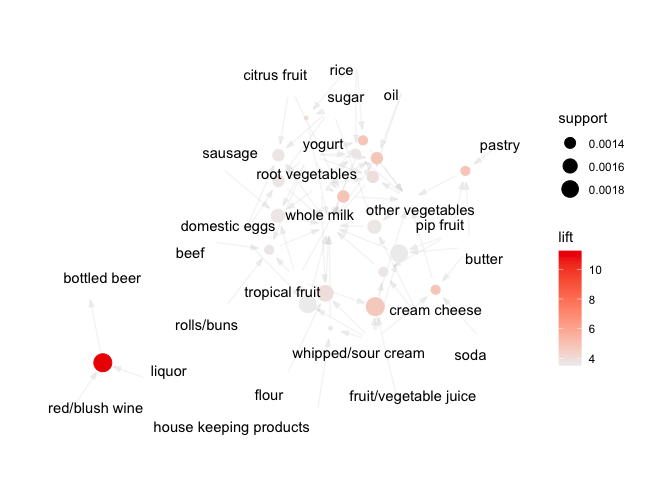

## The mapping from 20 different rules picked up from grocrules. Whole milk, yogurt, vegetables are at the center of the plot showing that they have a major role ot play in the rule mappings. Therefore, these prodcuts are picked up in combination with other products at a higher probability.

#### The plot shows a similar output when plotted by confidence or lift as parameter…shown below.

    plot(head(sort(grocrules, by="lift"), 20),
      method="graph", control=list(cex=.9))

    Warning: Unknown control parameters: cex

    Available control parameters (with default values):
    layout   =  stress
    circular     =  FALSE
    ggraphdots   =  NULL
    edges    =  <environment>
    nodes    =  <environment>
    nodetext     =  <environment>
    colors   =  c("#EE0000FF", "#EEEEEEFF")
    engine   =  ggplot2
    max  =  100
    verbose  =  FALSE

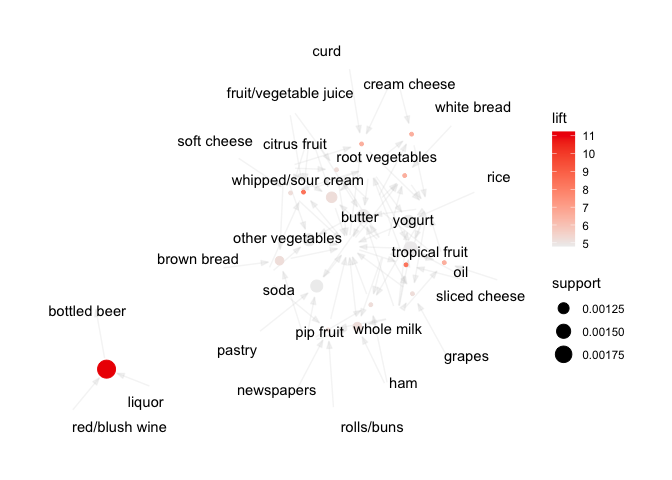
